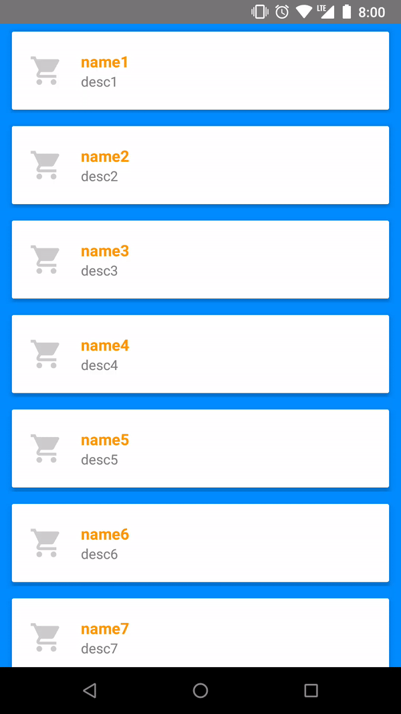
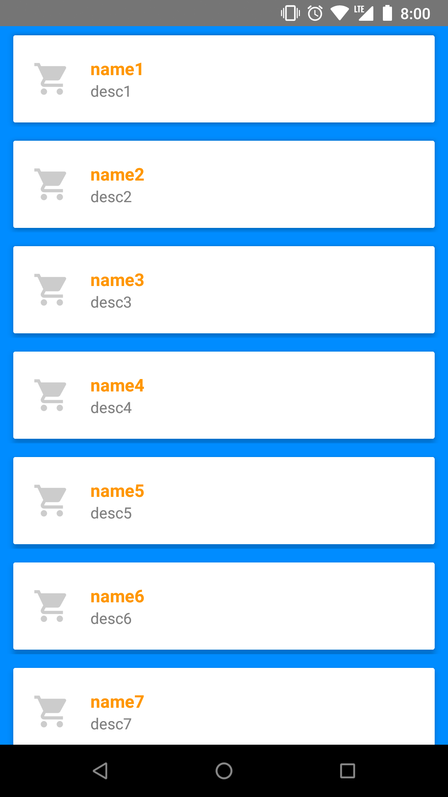
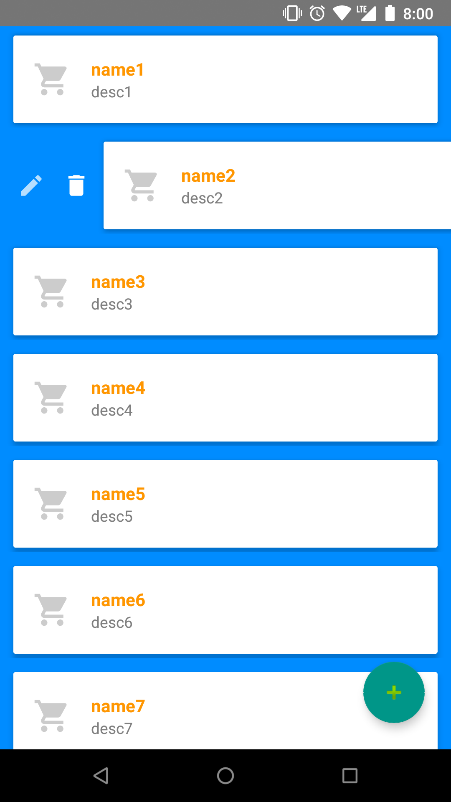
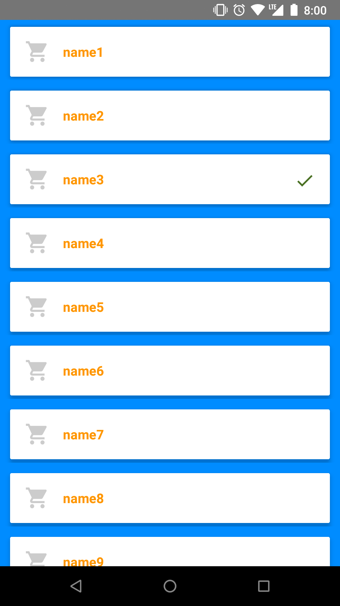

[  ](https://bintray.com/mathias/maven/reusableRecycler/_latestVersion)

# ReusableRecycler

ReusableRecycler is a library that allows you to leverage most of the boilerplate code you need to implement to use recycler views. This is not intended to fully replace Recycler views and Adapters, but to go faster in those easy to handle situations.
It can be used as a standard solution to manage elements in your app, as edit and remove icons/callbacks are included if ::onEdit, ::onRemove function references are provided. These will be visible after user swipes right.



## Getting Started

### Import the library

Gradle dependency

```
compile 'com.rego.jorge.reusablerecycler:reusablerecycler:$latest_version'
```

### Usage
First, define a frame layout in your main view. This layout will be used to inject the reusable recycler inside.

```kotlin
override fun onCreate(savedInstanceState: Bundle?) {
    super.onCreate(savedInstanceState)
    setContentView(R.layout.activity_sample)

    frameLayout?.let {
        reusableRecycler = ReusableRecycler(
                this,
                it,
                R.layout.item_sample_row,
                ::onBind,
                ::onClick,
                ::onAdd,
                ::onEdit,
                ::onRemove
        )
    }
```

Instantiate your ReusableRecycler object passing Context, FrameLayout, RowLayout, onBind functionality and behaviour functions. Note that behaviour functions are not mandatory, but this will have consequences ;) (keep reading).



If onAdd function is specified, FloatingButton is added to the layout to handle adding functionality. When clicking FAB, onAdd reference will be invoked.

Element swipe is automatically handled to display buttons based on provided function references. User can swipe right to move item row view and show icons, and can swipe left to move the view back. If onEdit and onRemove references are not specified in ReusableRecycler instantiation, swipe action won't be available and icons won't be shown. If just one of them is defined, only the specific icon will be shown.



### Extras

* Selected item internally managed by the library. Just check in your bind method if position matches with selected position.
```kotlin
private fun onBind(itemView: View, item: Item, position: Int) {
    itemView.checkIcon?.let {
        if (reusableRecycler.getSelectedElementPosition() == position) {
            it.visible()
        } else {
            it.invisible()
        }
    }
}
```
* selectableItemBackground animation when onClick reference is specified.



### Coding style
TBD

## Author

* **Jorge Rego** - [mathias21](https://github.com/mathias21)

Looking for new contributors to participate in this project.

## License

This project is licensed under the GNU Affero General Public License v3.0 - see the [LICENSE.md](LICENSE.md) file for details

## Acknowledgments

* selectableItemBackground is not working perfectly fine in some scenarios. Needed to be fixed at some point.  
* selectableItemBackground is not applied to icons, tbd in a future release
